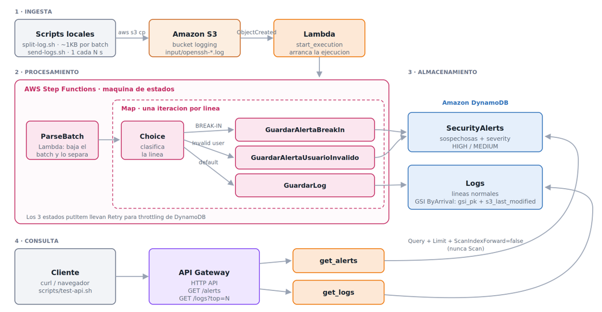

# Logging system

Sistema serverless que consume logs de OpenSSH en batches de ~1KB, los procesa con una maquina de
estados de Step Functions, separa los registros normales de los sospechosos en dos tablas de
DynamoDB y los expone por una HTTP API.

## Cambios entre entregas

| | Parte 1 | Parte 2 | Parte 3 | Parte 4 |
|---|---|---|---|---|
| Procesamiento | 1 Lambda | 1 Lambda | Maquina de estados | igual |
| Destino | CSV en S3 | Tabla `logging` | `Logs` y `SecurityAlerts` | igual |
| Clasificacion | no hay | no hay | Estado `Choice` | igual |
| Manejo de fallos | ninguno | reintento | `Retry` por tarea | igual |
| Consulta | bajar el CSV | Query a mano | Query a mano | **HTTP API** |
| Lambdas | 1 | 1 | 2 | **4** |

La tabla `logging` de la parte 2 se renombro a `Logs`, siguiendo el enunciado.

## Arquitectura



## La maquina de estados

Definicion en [`statemachine/logging-system.asl.json`](statemachine/logging-system.asl.json).

| Estado | Tipo | Que hace |
|---|---|---|
| `ParseBatch` | Task (Lambda) | Descarga el batch de S3 y lo separa en lineas parseadas. No escribe en DynamoDB. |
| `ProcesarLineas` | Map | Recorre las lineas, hasta 5 en paralelo. |
| `ClasificarLinea` | Choice | Decide si la linea es sospechosa. |
| `GuardarAlertaUsuarioInvalido` | Task (DynamoDB) | `SecurityAlerts` con `alert_type=INVALID_USER`. |
| `GuardarAlertaBreakIn` | Task (DynamoDB) | `SecurityAlerts` con `alert_type=BREAK_IN_ATTEMPT`. |
| `GuardarLog` | Task (DynamoDB) | `Logs`. |

### Como se arranca

S3 no puede invocar una maquina de estados con una notificacion de bucket: solo sabe llamar Lambda,
SNS y SQS. Por eso existe `start_execution`, una lambda de ~40 lineas que recibe el evento y llama a
`StartExecution`. No procesa nada.

La alternativa es mandar el evento por EventBridge, que si puede apuntar a Step Functions sin
intermediarios. No se uso porque en AWS Academy requiere que `LabRole` confie en
`events.amazonaws.com`, y eso no esta garantizado.

### Clasificacion

El `Choice` usa `StringMatches`, que compara con comodines directamente en la definicion; no hace
falta una lambda para clasificar.

```json
{ "Variable": "$.log", "StringMatches": "*Invalid user*",             "Next": "GuardarAlertaUsuarioInvalido" },
{ "Variable": "$.log", "StringMatches": "*POSSIBLE BREAK-IN ATTEMPT*", "Next": "GuardarAlertaBreakIn" }
```

**`StringMatches` distingue mayusculas.** Con las tres lineas del enunciado, la tercera
(`input_userauth_request: invalid user webmaster [preauth]`, en minusculas) se clasifica como
**normal**, porque el enunciado pide buscar `Invalid user` con mayuscula. Es el comportamiento
correcto segun la especificacion. Para atrapar tambien las minusculas habria que agregar una tercera
regla con `*invalid user*`.

### Retry

Cada tarea que escribe en DynamoDB lleva dos reglas de `Retry`:

```json
{ "ErrorEquals": ["DynamoDB.ProvisionedThroughputExceededException",
                  "DynamoDB.ThrottlingException",
                  "DynamoDB.RequestLimitExceeded",
                  "DynamoDB.InternalServerError"],
  "IntervalSeconds": 1, "MaxAttempts": 5, "BackoffRate": 2 }
```

Con `BackoffRate: 2` las esperas son 1s, 2s, 4s, 8s, 16s. Si DynamoDB rechaza una escritura por
throttling, solo se reintenta **esa** linea; las demas iteraciones del Map siguen su curso y la
ejecucion no falla. `ParseBatch` tambien tiene `Retry`, para errores transitorios del servicio de
Lambda.

### Por que parse_batch devuelve todo como texto

En Step Functions el `Item` del `putItem` se arma con tipos explicitos:

```json
"pid": { "N.$": "$.pid" }
```

`N.$` toma un **string** con digitos y lo guarda como numero. Si la lambda mandara un entero de JSON,
el estado fallaria en ejecucion. Por eso `parse_batch` convierte todo a string, incluidos `pid`,
`line` y `expires_at`. `./scripts/test-local.sh` verifica justamente esto.

Por la misma razon el `Item` tiene forma fija y no se pueden omitir campos: cuando un log no trae
pid, `parse_batch` manda `"0"`.


## La HTTP API

Dos endpoints, cada uno con su propia integracion y su propia lambda.

### `GET /alerts`

Todas las alertas registradas en `SecurityAlerts`, de la mas reciente a la mas vieja.

```bash
curl "$ENDPOINT/alerts"                # todas
curl "$ENDPOINT/alerts?limit=10"       # solo las 10 mas recientes
curl "$ENDPOINT/alerts?severity=HIGH"
```

DynamoDB corta cada pagina de `Query` en 1MB, asi que la lambda pagina con `LastEvaluatedKey` hasta
agotar el indice. Hay un tope de 1000 alertas por respuesta, porque una respuesta de Lambda no puede
pasar de 6MB; si se alcanza, el JSON incluye `"truncated": true`.

```json
{
  "count": 2,
  "alerts": [
    {
      "id": "2025-12-10T06:55:46#openssh-1790033516#0002",
      "timestamp": "Dec 10 06:55:46",
      "host": "LabSZ",
      "log": "Invalid user webmaster from 173.234.31.186",
      "severity": "MEDIUM",
      "alert_type": "INVALID_USER",
      "received_at": "2026-09-24T18:01:00Z"
    }
  ]
}
```

La `severity` no se calcula en la lambda: la escribe la maquina de estados como valor fijo del
estado, porque el `Choice` ya decidio el tipo de alerta.

| Estado | alert_type | severity |
|---|---|---|
| `GuardarAlertaBreakIn` | `BREAK_IN_ATTEMPT` | `HIGH` |
| `GuardarAlertaUsuarioInvalido` | `INVALID_USER` | `MEDIUM` |

### `GET /logs?top=N`

Los ultimos N logs de `Logs`. Default 10, maximo 100.

```bash
curl "$ENDPOINT/logs?top=5"
```

### El problema de "los ultimos N"

Las fechas dentro del log son de diciembre de 2017 y siempre las mismas, asi que ordenar por el
timestamp del log no sirve. Lo que si avanza es la hora en que cada batch llega a S3.

`parse_batch` guarda esa hora en `s3_last_modified`, tomada del `LastModified` que ya viene en la
respuesta de `get_object`: no cuesta una llamada extra.

### El GSI `ByArrival`

```
gsi_pk (HASH)            = "LOG" o "ALERT"    -> constante
s3_last_modified (RANGE) = hora real de llegada a S3
```

La particion constante es lo que permite usar `Query` en vez de `Scan`. `Query` necesita una llave de
particion exacta, asi que se le da una fija para que todos los registros del mismo tipo caigan en el
mismo grupo y queden ordenados por hora de llegada:

```python
table.query(
    IndexName="ByArrival",
    KeyConditionExpression=Key("gsi_pk").eq("LOG"),
    ScanIndexForward=False,   # de la mas reciente a la mas vieja
    Limit=top,                # DynamoDB corta aqui, no la lambda
)
```

Con `Limit`, DynamoDB lee y cobra solo los N items que regresa. Un `Scan` leeria la tabla entera cada
vez, y ademas no garantiza ningun orden.

**El costo de esta decision:** una particion constante concentra todas las escrituras en un mismo
lugar. A la escala de esta actividad no importa, pero en produccion seria un cuello de botella y se
partiria por dia (`"LOG#2026-09-24"`), a cambio de tener que consultar varios dias para armar una
lista larga.

**Nota:** el GSI solo indexa items que tengan `gsi_pk`. Los registros escritos antes de la parte 4 no
aparecen en los endpoints. Si la tabla trae datos viejos, lo mas simple es borrarla y volver a
ingerir.

### Validacion de parametros

| Peticion | Respuesta |
|---|---|
| `/alerts` | 200, todas las alertas |
| `/logs` | 200, `top=10` (default) |
| `/logs?top=5` | 200, 5 registros |
| `/logs?top=abc` | 400 con mensaje de error |
| `/logs?top=-1` | 400 con mensaje de error |
| `/logs?top=9999` | 200, recortado a 100 |

## Modelo de datos

Las dos tablas comparten esquema:

```
pk (HASH)  = "<hostname>#<program>"       ej. "LabSZ#sshd"
sk (RANGE) = "<ts_iso>#<batch>#<linea>"   ej. "2025-12-10T06:55:46#openssh-1790033516#0002"
```

Las dos tienen ademas el GSI `ByArrival` (`gsi_pk` + `s3_last_modified`), y `SecurityAlerts` agrega
`alert_type` (`INVALID_USER` o `BREAK_IN_ATTEMPT`) y `severity` (`HIGH` o `MEDIUM`).

**Por que la llave es compuesta:** las tres lineas del enunciado comparten timestamp, hostname y pid.
DynamoDB no permite dos items con la misma llave, asi que con un sort key de solo timestamp se
perderian dos de tres registros, sin aviso. Agregar batch y numero de linea ademas hace la escritura
idempotente: reprocesar un batch sobreescribe con lo mismo en vez de duplicar.

**Por que el timestamp se normaliza a ISO:** DynamoDB ordena los sort keys como texto. Con el formato
de syslog, `Dec 10` quedaria antes que `Feb 3` porque "D" va antes que "F". Como syslog no trae el
anio, se configura con `LOG_YEAR`.

## Estructura del proyecto

```
├── README.md
├── start_logging.sh                      # wrapper de send-logs.sh
├── data
│   └── sample.log                        # las 3 lineas del enunciado
├── report
│   ├── reporte-practica2                
│   └── figura1.png                       # diagrama de arquitectura
├── statemachine
│   └── logging-system.asl.json           # definicion de la maquina de estados
├── scripts
│   ├── config.sh                         # variables compartidas
│   ├── check-aws.sh
│   ├── create-infra.sh                   # crea TODO
│   ├── create-s3-bucket.sh
│   ├── create-dynamodb-tables.sh         # tablas + GSI ByArrival
│   ├── package-lambdas.sh
│   ├── deploy-lambdas.sh
│   ├── create-state-machine.sh
│   ├── configure-trigger.sh
│   ├── create-http-api.sh                # HTTP API + rutas + permisos
│   ├── test-api.sh                       # llama los dos endpoints
│   ├── get-loghub-log.sh                 # descarga el log de la clase
│   ├── generate-log.sh                   # log sintetico (sin internet)
│   ├── split-log.sh
│   ├── send-logs.sh
│   ├── query-logs.sh
│   ├── test-local.sh                     # simula la maquina de estados sin AWS
│   └── teardown.sh
└── src
    ├── parse_batch                        # la llama la maquina de estados
    │   ├── lambda_function.py
    │   └── requirements.txt
    ├── start_execution                    # la llama S3
    │   ├── lambda_function.py
    │   └── requirements.txt
    ├── get_alerts                         # GET /alerts
    │   ├── lambda_function.py
    │   └── requirements.txt
    └── get_logs                           # GET /logs?top=N
        ├── lambda_function.py
        └── requirements.txt
```

## Configuracion

Todos los scripts leen `scripts/config.sh`. Los nombres de bucket en S3 son **globales**: cambia el
prefijo por el de tu equipo antes de empezar.

```bash
export BUCKET_NAME=ccg1-logging-equipo3
```

`config.sh` tambien exporta `AWS_PROFILE` (default `nube`) y `AWS_DEFAULT_REGION`, asi que no hace
falta escribir `--profile` en cada comando. Para comandos `aws` manuales en una terminal nueva:

```bash
source scripts/config.sh
```

## Uso

### 0. Requisitos

- AWS CLI configurado (en AWS Academy: copiar las credenciales del Learner Lab a `~/.aws/credentials`)
- Python 3 instalado (el comando `zip` es opcional: si no existe, se comprime con Python)

### 1. Verificar credenciales

```bash
./scripts/check-aws.sh
```

### 2. Crear toda la infraestructura

```bash
./scripts/create-infra.sh
```

Crea, en orden: bucket, tablas con su GSI, las cuatro lambdas, la maquina de estados, el trigger y la
HTTP API. El orden importa porque la
maquina necesita el ARN de `parse_batch` y `start_execution` necesita el ARN de la maquina. Todos los
pasos son idempotentes.

### 3. Conseguir el log y partirlo en batches

Se usa el dataset **OpenSSH de loghub** (`logpai/loghub`), el de la clase. El completo son 655,146
lineas y 70MB, asi que se descarga la muestra `OpenSSH_2k.log` (2000 lineas, 225KB), cuyas primeras
tres lineas son justo las del enunciado:

```bash
./scripts/get-loghub-log.sh 300                     # ~29 batches -> data/openssh.log
./scripts/split-log.sh data/openssh.log batches 1024
```

Sin argumento descarga las 2000 lineas (~220 batches). Con 300 lineas salen 29 batches, que a 30
segundos cada uno son ~15 minutos: suficiente para el video sin que se alargue.

Si el laboratorio no tiene salida a internet, `./scripts/generate-log.sh 200` genera un log sintetico
con el mismo formato y semilla fija.

`data/openssh.log` no se sube al repo (esta en `.gitignore`): se descarga con un comando.

**Tamano de batch:** 1KB, el que pide la practica. `split-log.sh` acumula lineas completas hasta
pasar ese limite, por eso cada batch queda un poco arriba de 1024 bytes: no se parte una linea a la
mitad.

### 4. Enviar los batches

```bash
./start_logging.sh 60
```

## Validacion

### Step Functions (vista Graph)

1. **Step Functions → State machines → `logging-system`**
2. Abrir una ejecucion de la lista
3. Pestana **Graph view**

Se ve `ParseBatch`, el `Map` y, dentro, las tres ramas. En **Table view** se puede abrir cada
iteracion del Map y confirmar a que estado entro cada linea.

### Las dos tablas

En **DynamoDB → Tables → Explore table items**, con **Query** (no Scan) y `pk = LabSZ#sshd`:

- `Logs`: lineas normales
- `SecurityAlerts`: solo sospechosas, cada una con su `alert_type`

Repetir el **Run** cada minuto: los conteos suben conforme llegan batches.

Desde la terminal, las dos tablas a la vez:

```bash
./scripts/query-logs.sh                 # conteos
./scripts/query-logs.sh LabSZ#sshd -v   # ademas las ultimas alertas
```

### La HTTP API

```bash
./scripts/test-api.sh 5
```

Llama `/alerts`, `/alerts?severity=HIGH` y `/logs?top=5`, y formatea la respuesta. Tambien se puede a
mano:

```bash
ENDPOINT=$(cat build/api-endpoint.txt)
curl "$ENDPOINT/logs?top=3"
```

Si se corre dos veces con un minuto de diferencia mientras `start_logging.sh` esta enviando batches,
los `received_at` de `/logs` van cambiando: son logs recien llegados.

### Sin AWS

```bash
./scripts/test-local.sh data/sample.log
```

Corre `parse_batch` en local, lee el ASL, evalua las reglas del `Choice` tal como estan en el JSON y
comprueba que cada campo del `Item` exista y tenga el tipo correcto. Con las 3 lineas del enunciado
el resultado esperado es 1 `INVALID_USER`, 1 `BREAK_IN_ATTEMPT` y 1 normal.

## Debug

```bash
# Ejecuciones recientes y su estado
aws stepfunctions list-executions \
  --state-machine-arn "$(aws stepfunctions list-state-machines \
     --query "stateMachines[?name=='logging-system'].stateMachineArn | [0]" --output text)" \
  --max-items 5 --output table

# Logs de las lambdas
aws logs tail /aws/lambda/parse_batch --since 10m
aws logs tail /aws/lambda/start_execution --since 10m
aws logs tail /aws/lambda/get_logs --since 10m
```

Si un endpoint responde **500** sin mas explicacion, casi siempre es que falta el permiso para que
API Gateway invoque la lambda. Se arregla volviendo a correr `./scripts/create-http-api.sh`.

Si `/logs` responde **200 con la lista vacia** pero la tabla tiene datos, es que esos registros se
escribieron antes de la parte 4 y no tienen `gsi_pk`, asi que el indice no los ve.

Si no llegan registros, revisar en orden:

1. Que el batch se haya subido: `aws s3 ls s3://$BUCKET_NAME/input/`
2. Que `start_execution` se haya ejecutado (sus logs)
3. Que tenga el ARN:
   `aws lambda get-function-configuration --function-name start_execution --query 'Environment'`
4. En la vista Graph, que estado quedo en rojo

**Nota sobre el log group:** CloudWatch crea el log group la **primera vez** que la lambda corre. Si
`aws logs tail` dice que no existe, es que todavia no se ha ejecutado.

## Decisiones tecnicas

- **La clasificacion vive en el `Choice`, no en una lambda.** `StringMatches` hace el trabajo sin
  codigo, sin costo de invocacion y queda visible en el Graph.
- **Dos estados de alerta en vez de uno** con condicion combinada: permite guardar un `alert_type`
  distinto y hace visible la separacion en el Graph, que es justo lo que se valida.
- **`Map` con `MaxConcurrency: 5`** en modo INLINE. Un batch de 1KB son ~10 lineas, muy por debajo
  del limite de 256KB de payload entre estados.
- **`PAY_PER_REQUEST`** en las tablas: no hay que adivinar la capacidad y no cobra en reposo.
- **TTL de 7 dias** sobre `expires_at`: un sistema de logs no deberia guardar todo para siempre.
- **Las lineas que no parsean no se descartan**: se guardan con `parsed=false`.
- **`Query` con `Limit` en vez de `Scan`**: DynamoDB corta del lado del servidor, asi que solo se
  leen y se cobran los N items que se regresan.
- **`severity` la escribe la maquina de estados**, no la lambda de la API: el `Choice` ya decidio el
  tipo de alerta, recalcularlo al leer seria duplicar la regla en dos lugares.
- **Los endpoints tienen un tope maximo** (100): sin el, un `?top=999999` podria vaciar la tabla en
  una sola peticion.
- **Los clientes de boto3 se crean de forma perezosa**: Lambda los reutiliza entre invocaciones
  calientes, y el modulo se puede importar sin credenciales para probarlo en local.


## Checklist de la practica

| # | Requisito | Donde esta |
|---|---|---|
| 1 | Scripts que generan toda la infraestructura | `scripts/create-infra.sh` (6 pasos) |
| 2 | Envio de batches de ~1KB cada N segundos | `scripts/split-log.sh` + `./start_logging.sh 30` |
| 3 | Lambda que descarga el batch y lo separa en lineas | `src/parse_batch/` |
| 4 | Estado `Map` que clasifica cada linea | `ProcesarLineas` en el ASL |
| 5 | Estado `Choice` que dirige a la tabla correspondiente | `ClasificarLinea` en el ASL |
| 6 | `Retry` en las escrituras a DynamoDB | 2 reglas en cada uno de los 3 estados `putItem` |
| 7 | `GET /alerts` con id, timestamp, host, log, severity | `src/get_alerts/` |
| 8 | `GET /logs?top=N` con GSI por `LastModified` | `src/get_logs/` + GSI `ByArrival` |
| 9 | README y codigo organizado | este archivo |
| 10 | Limpieza de recursos | `scripts/teardown.sh` |

## Destruir recursos

```bash
./scripts/teardown.sh
```

Borra bucket, las dos tablas, la maquina de estados, las dos lambdas y sus log groups.

## Video de prueba

En el siguiente video se muestra el funcionamiento de la app:

[Ver video de prueba](https://youtu.be/SFruyIpXJo0)